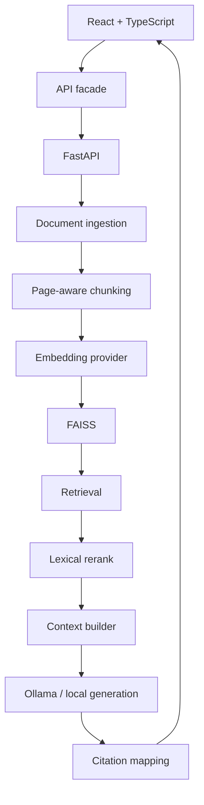

# NEXUS — AI Document Intelligence

> **Search beyond keywords. Understand everything.**

NEXUS is a cinematic document-intelligence workspace backed by a **local-first RAG pipeline**. It combines an art-directed React experience with a FastAPI backend for document ingestion, page-aware chunking, configurable embeddings, persistent FAISS retrieval, hybrid search, reranking, grounded answers, and source-level citation inspection.

[**GitHub Repository**](https://github.com/Sohan1606/nexus-ai-document-intelligence)

---

## Why NEXUS exists

Traditional document search asks users to remember the exact words they are looking for.

NEXUS is designed around a different interaction:

```text
Question
   ↓
Retrieve evidence
   ↓
Rank evidence
   ↓
Build context
   ↓
Generate grounded answer
   ↓
Inspect the source
```

The product deliberately makes the **evidence trail** visible. An answer is not the end of the interaction; the user can follow a citation back to the supporting document, page, section, and passage.

---

## What is real vs. simulated

| Capability | Status |
| --- | --- |
| Cinematic React product experience | **Real** |
| FastAPI backend | **Real** |
| PDF / Markdown / TXT ingestion | **Real** |
| Page-aware chunking | **Real** |
| FAISS vector index | **Real** |
| Persistent local index | **Real** |
| Hashing embeddings | **Real** |
| Sentence-Transformers / MiniLM option | **Implemented, optional** |
| Hybrid retrieval | **Real** |
| Lexical reranking | **Real** |
| Ollama local generation | **Real path; verify on the target machine** |
| Extractive grounded fallback | **Real** |
| Citation mapping | **Real** |
| Frontend demo mode | **Real** |
| Production-scale benchmark claims | **No** |

The seeded evaluation is intentionally presented as a **small local prototype measurement**, not a production SLO or general statement about RAG quality.

---

## Product highlights

### Cinematic interface

A design-led React experience built as a product film rather than a conventional SaaS dashboard.

### Intelligence workspace

A three-column workspace for:

- document discovery
- search
- assistant conversations
- collections
- saved answers
- history
- evidence inspection

### Retrieval trace

The interface exposes the retrieval story:

```text
Understand
→ Search
→ Retrieve
→ Rerank
→ Context
→ Generate
→ Cite
```

### Evidence inspector

Every returned citation can be opened to inspect:

- source document
- page
- section
- retrieved passage
- retrieval score
- surrounding context

### Document viewer

Citation-to-source navigation keeps the answer grounded in an inspectable document location.

### Cross-document workflows

NEXUS includes a policy comparison experience and related-document exploration so the product feels like document intelligence rather than a basic chat wrapper.

### Local-first architecture

The project is designed to run without mandatory paid AI infrastructure. Demo mode requires no backend at all; local mode uses FastAPI, FAISS, and optionally Ollama.

---

## Architecture



### Two runtime modes

```text
DEMO MODE
React → local demo corpus → in-browser simulation

LOCAL RAG MODE
React → FastAPI → ingestion / embeddings / FAISS / retrieval → Ollama or extractive fallback
```

### Core stack

**Frontend**

- React 19
- TypeScript
- Vite
- Tailwind CSS
- Framer Motion
- Lenis
- React Router
- Lucide

**Backend**

- Python
- FastAPI
- Pydantic
- pypdf
- FAISS
- python-dotenv
- optional Sentence-Transformers
- optional Ollama

---

## Run on Windows

The commands below assume **PowerShell** and that VS Code is opened at the `nexus` project root.

### 1. Confirm the project

```powershell
Get-ChildItem package.json, backend\requirements.txt
```

### 2. Demo mode

No Python backend and no Ollama required.

```powershell
npm install
npm run dev
```

Open:

```text
http://localhost:5173/
http://localhost:5173/workspace
```

### 3. Local RAG mode

From the project root, create the environment files once:

```powershell
Copy-Item .env.example .env
Copy-Item backend\.env.example backend\.env
```

Set the root `.env` to:

```text
VITE_API_MODE=local
VITE_API_BASE_URL=
```

Then create the Python environment using the supported Python version on your machine. Python 3.13 is a good Windows choice for this project:

```powershell
py -3.13 -m venv backend\.venv
.\backend\.venv\Scripts\Activate.ps1
python -m pip install --upgrade pip
python -m pip install -r backend\requirements.txt
```

If PowerShell blocks activation:

```powershell
Set-ExecutionPolicy -Scope CurrentUser RemoteSigned
```

Start FastAPI from the `backend` directory:

```powershell
Set-Location backend
python -m uvicorn app.main:app --host 127.0.0.1 --port 8000
```

Keep that terminal running.

Open a second VS Code terminal at the project root:

```powershell
npm install
npm run dev
```

Then open:

```text
http://localhost:5173/workspace
```

The backend health endpoint is:

```text
http://127.0.0.1:8000/health
```

Or:

```powershell
Invoke-RestMethod http://127.0.0.1:8000/health
```

---

## Optional: Ollama local generation

Ollama is optional. Without it, NEXUS still returns **extractive answers based on retrieved evidence**.

Install Ollama for Windows from the official installer, then check:

```powershell
ollama --version
ollama list
Invoke-RestMethod http://127.0.0.1:11434/api/tags
```

Pull a model that exists on your machine. For example:

```powershell
ollama pull llama3.2:3b
```

Then set the backend model in `backend\.env`:

```text
OLLAMA_BASE_URL=http://127.0.0.1:11434
OLLAMA_MODEL=llama3.2:3b
```

Restart FastAPI after changing backend environment variables.

A direct Ollama smoke test is:

```powershell
$body = @{
    model = "llama3.2:3b"
    system = "You are a simple test model. Reply only with the exact words requested by the user."
    prompt = "Reply with exactly: NEXUS OLLAMA TEST"
    stream = $false
    keep_alive = 0
} | ConvertTo-Json

Invoke-RestMethod `
    -Uri http://127.0.0.1:11434/api/generate `
    -Method Post `
    -ContentType "application/json" `
    -Body $body
```

For NEXUS itself, check `/health` and then ask a question in `/workspace`. In a successful local-generation response, the trace should report `llm: ollama` rather than `llm: extractive`.

Ollama is **not a mandatory dependency** and is not started by the Docker compose setup.

---

## Recommended smoke tests

### Retrieval

Ask:

```text
Where should FAISS shards live?
```

The seeded corpus should surface the **Kubernetes Operations Guide** evidence around page 41.

### Evidence trail

```text
Answer
→ click [1]
→ Evidence Inspector
→ Open document
```

### No-evidence behavior

Ask:

```text
Who won the FIFA World Cup in 1950?
```

Because this is outside the seeded corpus, NEXUS should refuse to present an unsupported document-grounded answer and return no-evidence behavior.

### Real upload

Upload a text-based PDF and confirm:

```text
Upload
→ Extract
→ Chunk
→ Embed
→ Index
→ Ready
→ Search
→ Ask
→ Cite
```

The newly uploaded document should appear in the workspace and participate in retrieval.

### Persistence

Restart FastAPI and search for the same uploaded content again. The local index and metadata should reload from the backend data directory.

---

## Embedding providers

NEXUS intentionally supports two local embedding paths.

| Provider | Configuration | Notes |
| --- | --- | --- |
| `hash` | `NEXUS_EMBEDDING_PROVIDER=hash` | Lightweight hashed unigram/bigram vectors. No model download. **Lexical, not neural semantic embeddings.** |
| `sbert` | `NEXUS_EMBEDDING_PROVIDER=sbert` | Sentence-Transformers with a MiniLM-style model such as `all-MiniLM-L6-v2`. Local and no paid API required. |

For SBERT:

```powershell
Set-Location backend
.\..\backend\.venv\Scripts\Activate.ps1
python -m pip install "sentence-transformers>=3.0"
```

Then in `backend\.env`:

```text
NEXUS_EMBEDDING_PROVIDER=sbert
NEXUS_EMBEDDING_MODEL=all-MiniLM-L6-v2
```

Changing embedding provider/model writes embedding metadata and prevents incompatible vectors from being silently mixed with an existing index.

The published evaluation below was run with the **hash-ngram** provider, not SBERT.

---

## Retrieval evaluation

The repository includes a small local retrieval evaluation under `backend/eval/`.

Latest measured run:

| Metric | Value |
| --- | ---: |
| Recall@1 | **0.286** |
| Recall@3 | **0.714** |
| Recall@5 | **0.929** |
| HitRate@5 | **0.929** |
| MRR | **0.542** |

Evaluation setup:

- 14 queries
- 13 seeded documents
- 28 chunks
- hash-ngram 384-dimensional embeddings
- hybrid retrieval
- lexical reranking

These numbers are **development measurements**, not production SLOs, not a benchmark leaderboard, and not evidence of general semantic-search quality. The evaluation intentionally contains paraphrased/conceptual queries so the lightweight default embedder's limitations are visible.

Run locally:

```powershell
Set-Location backend
.\..\backend\.venv\Scripts\Activate.ps1
python -m eval.run_eval
python -m pytest
```

---

## API

Key endpoints:

```text
GET  /health
GET  /api/documents
GET  /api/documents/{id}
GET  /api/documents/{id}/pages/{page}
POST /api/search
POST /api/chat
POST /api/documents/upload
GET  /api/evidence/{id}
GET  /api/collections
POST /api/collections
GET  /api/saved
POST /api/saved
GET  /api/history
POST /api/history
```

The frontend talks to the backend through `src/services/api.ts`, keeping the UI decoupled from the backend implementation.

Errors use structured JSON such as:

```json
{
  "error": "...",
  "code": "..."
}
```

without exposing backend stack traces or filesystem paths.

---

## Security posture

NEXUS includes basic defensive measures appropriate for a local prototype:

- upload size limits
- extension/content validation
- UUID-backed storage names
- path-safety checks
- configurable CORS allow-list
- environment-based configuration
- no secrets committed to source
- citation-ID validation
- untrusted-document delimiters for generation prompts
- no-evidence refusal for weak retrieval

These are **prototype mitigations**, not a claim of production-grade security or formal certification.

---

## Docker

Docker is optional.

The repository contains frontend and backend Docker configuration plus `docker-compose.yml`.

Try:

```powershell
docker compose up --build
```

Ollama is intentionally not started by compose. The local Ollama service can run separately on the host.

The repository version used for this portfolio project was packaged and verified without Docker image execution in the build environment, so Docker runtime compatibility should be validated on the target machine.

---

## Repository structure

```text
nexus/
├── src/
│   ├── components/
│   ├── data/
│   ├── hooks/
│   ├── pages/
│   ├── services/
│   ├── types/
│   └── workspace/
├── backend/
│   ├── app/
│   │   ├── api/
│   │   ├── citations/
│   │   ├── embeddings/
│   │   ├── generation/
│   │   ├── ingestion/
│   │   ├── models/
│   │   ├── rag/
│   │   ├── retrieval/
│   │   └── storage/
│   ├── corpus/
│   ├── eval/
│   ├── tests/
│   └── requirements.txt
├── docker-compose.yml
├── Dockerfile
├── package.json
└── README.md
```

---

## GitHub workflow

This repository is source-first. Runtime state is intentionally ignored.

Typical local publishing flow:

```powershell
git init
git add .
git commit -m "feat: build NEXUS AI document intelligence platform"
git branch -M main
git remote add origin <YOUR_GITHUB_REPO_URL>
git push -u origin main
```

Never commit:

```text
.env
backend/.env
backend/.venv/
backend/data/
node_modules/
dist/
FAISS runtime indexes
uploaded runtime files
```

---

## Design philosophy

NEXUS is intentionally built at the intersection of **product design and systems engineering**.

The landing experience communicates the idea through motion and visual storytelling.

The workspace makes the idea usable.

The backend makes the idea real.

The evidence layer makes the result inspectable.

The local-first approach keeps the core stack accessible without requiring a paid AI provider.

---

## Inspiration

The repository `mayooear/ai-pdf-chatbot-langchain` was used as **conceptual inspiration** for the broader PDF/RAG direction. It is not the source implementation of NEXUS.

---

## Status

**Portfolio-ready local-first RAG prototype.**

The project has been tested locally on Windows with:

- React/Vite frontend
- FastAPI backend
- FAISS retrieval
- real PDF ingestion
- persisted retrieval state
- Ollama `llama3.2:3b` generation
- source citations

Production-scale deployment, large-corpus evaluation, claim-level NLI verification, and distributed infrastructure are intentionally outside the scope of this project.
