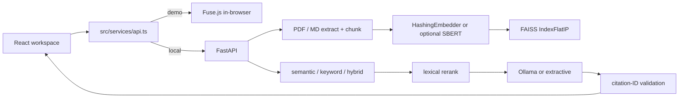

# NEXUS — AI Document Intelligence

**Your documents. Finally searchable by thought.**

NEXUS is a cinematic product film **and** a local-first document intelligence workspace. The frontend is an art-directed React prototype. The backend is a real RAG pipeline: PDF ingest, page-aware chunking, embeddings, persistent FAISS, hybrid retrieval, and optional Ollama (with an extractive fallback).

**GitHub description:** NEXUS is a cinematic AI document intelligence platform combining React, FastAPI, FAISS, and local/open-source RAG with source-grounded citation inspection.

Nothing here claims live paid inference, production latency, certifications, or customers.

[mayooear/ai-pdf-chatbot-langchain](https://github.com/mayooear/ai-pdf-chatbot-langchain) is **conceptual inspiration**, not this repository.

---

## Contents

1. [What you get](#what-you-get)
2. [Prerequisites (Windows)](#prerequisites-windows)
3. [Run demo mode](#run-demo-mode)
4. [Run local RAG](#run-local-rag)
5. [Optional Ollama](#optional-ollama)
6. [Smoke tests](#smoke-tests)
7. [Environment variables](#environment-variables)
8. [Embeddings (hash vs SBERT)](#embeddings-hash-vs-sbert)
9. [Evaluation](#evaluation)
10. [Docker (optional)](#docker-optional)
11. [API](#api)
12. [Troubleshooting](#troubleshooting)
13. [Publish to GitHub](#publish-to-github)
14. [Architecture](#architecture)

All commands below are **PowerShell**. They assume the current directory is the `nexus` folder (the one that contains `package.json` and `backend\`). In VS Code: **File → Open Folder** on `nexus`, then **Terminal → New Terminal**.

Confirm:

```powershell
Get-ChildItem package.json, backend\requirements.txt
```

---

## What you get

| Mode | How | What it is |
| --- | --- | --- |
| **Demo retrieval** | `VITE_API_MODE=demo` (default) | In-browser simulation. Fuse.js is **only** used here. No Python required. |
| **Local RAG** | `VITE_API_MODE=local` + FastAPI | Upload → extract → chunk → embed → FAISS → retrieve → rerank → generate → citations. |
| **Local RAG + Ollama** | same, plus Ollama running | Same retrieval, answers generated by a local model. |

If local mode is on and FastAPI is down, the UI **falls back to demo**. Ollama is never required. Docker is never required.

Supported upload types: `.pdf`, `.md`, `.txt` (15 MB). Scanned image-only PDFs are rejected (no extractable text).

---

## Prerequisites (Windows)

Install these **once**. Then close and reopen VS Code so `PATH` updates.

| Tool | Version | Where |
| --- | --- | --- |
| Windows | 10 or 11 | — |
| VS Code | current | https://code.visualstudio.com |
| Git | current | https://git-scm.com/download/win |
| Python | **3.11, 3.12, or 3.13** (3.12 recommended) | https://www.python.org/downloads/ — tick **Add python.exe to PATH** |
| Node.js | **20 LTS or newer** | https://nodejs.org (LTS) |
| Ollama | optional | https://ollama.com/download |

Check:

```powershell
py -3 --version
node --version
npm --version
git --version
```

If `py` is not found, use `python` in place of `py -3` for the rest of this guide.

---

## Run demo mode

No backend. No Ollama. This is the default.

**Terminal 1** (project root):

```powershell
npm install
npm run dev
```

Open http://127.0.0.1:5173

- `/` — product film
- `/workspace` — application (demo retrieval)

Stop with `Ctrl+C`.

---

## Run local RAG

Two terminals. Ollama is **not** required; answers will be extractive readings of retrieved passages.

### STEP 1 — Environment files (once)

From the project root:

```powershell
Copy-Item .env.example .env
Copy-Item backend\.env.example backend\.env
```

Edit the **root** `.env` so local mode is on. The file should contain:

```
VITE_API_MODE=local
VITE_API_BASE_URL=
```

Leave `VITE_API_BASE_URL` empty. Vite proxies `/api` and `/health` to `http://127.0.0.1:8000`.

`backend\.env` can stay as copied. Hashing embeddings and extractive answers are the defaults.

### STEP 2 — Backend venv (once per machine)

**Terminal 1:**

```powershell
Set-Location backend
py -3 -m venv .venv
.\.venv\Scripts\Activate.ps1
python -m pip install --upgrade pip
python -m pip install -r requirements.txt
```

If `Activate.ps1` is blocked, run **once** (CurrentUser only):

```powershell
Set-ExecutionPolicy -Scope CurrentUser RemoteSigned
```

Then retry `.\.venv\Scripts\Activate.ps1`.

Stay in `backend` with the venv active for backend commands.

### STEP 3 — Start FastAPI

Same terminal, still in `backend`, venv active:

```powershell
python -m uvicorn app.main:app --host 127.0.0.1 --port 8000
```

Leave this running. First start seeds 13 short markdown documents into `backend\data\`.

Check in a browser: http://127.0.0.1:8000/health

Or:

```powershell
Invoke-RestMethod http://127.0.0.1:8000/health
```

You should see `"ok": true`, `"embedding": "hash-ngram"`, and a non-zero `"chunks"` count. `"llm.available"` is `false` until Ollama is running.

### STEP 4 — Start the frontend

**Terminal 2** (project root, new VS Code terminal):

```powershell
npm install
npm run dev
```

Open http://127.0.0.1:5173/workspace

Workspace → Settings should read **Real local RAG (local)** and FastAPI reachable.

Restart `npm run dev` whenever you change a `VITE_` variable.

---

## Optional Ollama

The app works without this. Enable it only if you want generated (not extractive) answers.

### 1. Install

Download Windows Ollama from https://ollama.com/download and install it. The app usually stays running in the tray.

### 2. Verify

```powershell
ollama --version
Invoke-RestMethod http://127.0.0.1:11434/api/tags
```

### 3. Pull the model this repo is configured for

```powershell
ollama pull llama3.2
ollama list
```

`llama3.2` is the default in `backend/.env.example` (`OLLAMA_MODEL=llama3.2`). It is a small local model (on the order of 2 GB download). A machine with **8 GB+ RAM** is a practical minimum; 16 GB is more comfortable. This environment did **not** run Ollama, so treat generation as “works if Ollama is healthy on your machine.”

### 4. Point the backend at it

`backend\.env` already has:

```
OLLAMA_BASE_URL=http://127.0.0.1:11434
OLLAMA_MODEL=llama3.2
```

Restart FastAPI if it was already running (Ctrl+C, then the uvicorn command again).

### 5. Confirm health

```powershell
Invoke-RestMethod http://127.0.0.1:8000/health
```

`"llm.available"` should be `true`.

Compose / Docker do **not** start Ollama. On Windows, the host Ollama service is the intended path (`127.0.0.1:11434`).

---

## Smoke tests

### A. Local RAG without Ollama (extractive)

1. FastAPI running on port 8000.
2. `GET /health` returns `ok: true`.
3. Frontend in local mode at `/workspace`.
4. Search for: `FAISS shards live on local NVMe`  
   Expect a hit on **Kubernetes Operations Guide**, page 41 (seeded corpus).
5. Ask: `Where should FAISS shards live?`  
   Expect an extractive answer that **says Ollama is not running**, plus citations.
6. Click a citation → Evidence Inspector → open the document viewer.
7. Upload a **text PDF** (not a screenshot scan). Wait until status is Ready. Confirm it appears under Documents.
8. Search for a phrase you know is in that PDF.
9. Stop FastAPI (Ctrl+C) and start it again. Search the same phrase. The index lives in `backend\data\` and should still hit.

PowerShell equivalents (backend does not have to use the UI):

```powershell
Invoke-RestMethod http://127.0.0.1:8000/health

Invoke-RestMethod -Method Post -Uri http://127.0.0.1:8000/api/search -ContentType 'application/json' -Body '{"query":"FAISS shards live on local NVMe","mode":"hybrid"}'

Invoke-RestMethod -Method Post -Uri http://127.0.0.1:8000/api/chat -ContentType 'application/json' -Body '{"query":"Where should FAISS shards live?"}'
```

### B. Local RAG with Ollama

Same as A, but `/health` shows `"llm.available": true`. Ask `Where should FAISS shards live?` and expect a generated paragraph with `[n]` citations, not the extractive “Ollama is not running” preface.

### C. No-evidence refusal

Ask: `Who won the World Cup in 1950?`

Expect: *I couldn't find sufficient evidence in the indexed documents to answer this.* and no citations.

### D. Demo fallback

Stop FastAPI. Refresh the workspace. Local mode should fall back to the in-browser demo corpus so the UI stays usable.

---

## Environment variables

### Frontend (project root `.env`) — baked in at Vite startup

| Variable | Required | Default | Meaning |
| --- | --- | --- | --- |
| `VITE_API_MODE` | no | `demo` | `demo` or `local` |
| `VITE_API_BASE_URL` | no | empty | FastAPI origin. Empty = Vite proxy / same origin |
| `VITE_DEMO_MODE` | no | — | Compatibility only; prefer `VITE_API_MODE` |

Do not put secrets in frontend env files. Anything `VITE_` is visible to the browser.

### Backend (`backend/.env`) — loaded by python-dotenv

| Variable | Required | Default | Meaning |
| --- | --- | --- | --- |
| `NEXUS_DATA_DIR` | no | `backend/data` | Index, uploads, JSON store |
| `NEXUS_CORPUS_DIR` | no | `backend/corpus` | Seed markdown |
| `NEXUS_EMBEDDING_PROVIDER` | no | `hash` | `hash` or `sbert` |
| `NEXUS_EMBEDDING_MODEL` | no | `all-MiniLM-L6-v2` | Used only when provider is `sbert` |
| `NEXUS_EMBEDDING_DIM` | no | `384` | Hashing dimension |
| `NEXUS_MIN_EVIDENCE_SCORE` | no | `0.08` | Drop weak evidence |
| `NEXUS_CORS_ORIGINS` | no | localhost 5173/8080 | Allow-list, not `*` |
| `OLLAMA_BASE_URL` | no | `http://127.0.0.1:11434` | Optional |
| `OLLAMA_MODEL` | no | `llama3.2` | Optional |

PowerShell one-shot (usually unnecessary if `.env` exists):

```powershell
$env:NEXUS_EMBEDDING_PROVIDER = "hash"
$env:OLLAMA_MODEL = "llama3.2"
```

---

## Embeddings (hash vs SBERT)

| Provider | Env | What it is |
| --- | --- | --- |
| **HashingEmbedder** (default) | `NEXUS_EMBEDDING_PROVIDER=hash` | Lexical hashed unigram+bigram bag, 384-d, L2-normalized. **Not** a neural semantic model. Zero download. Used in tests. |
| **SentenceTransformerEmbedder** | `NEXUS_EMBEDDING_PROVIDER=sbert` | Local `all-MiniLM-L6-v2`, 384-d. Requires `pip install sentence-transformers` and a model download (~80 MB). No paid API. |

Enable SBERT (optional, heavier):

```powershell
Set-Location backend
.\.venv\Scripts\Activate.ps1
python -m pip install "sentence-transformers>=3.0"
```

In `backend\.env`:

```
NEXUS_EMBEDDING_PROVIDER=sbert
NEXUS_EMBEDDING_MODEL=all-MiniLM-L6-v2
```

Restart FastAPI. Switching providers writes `embed_meta.json`. If name or dimension disagrees with the on-disk FAISS index, the index is **rebuilt** from stored chunks. Vectors from different models are not mixed.

SBERT was **not** installed or benchmarked in the environment that produced this README. Do not read the eval table below as MiniLM scores.

If `faiss-cpu` fails to install on your machine, the backend still runs: `VectorIndex` falls back to a NumPy inner-product index. Retrieval quality of that fallback matches FAISS IndexFlatIP on this tiny corpus; install FAISS when you can.

---

## Evaluation

These numbers are **local prototype measurements** on the bundled seed corpus. They are **not** production SLOs, not a leaderboard, and not neural-semantic quality.

| Field | Value |
| --- | --- |
| When | 2026-09-06 |
| n | 14 queries / 13 docs / 28 chunks |
| Embeddings | hash-ngram, 384-d (**lexical**) |
| Retrieval | hybrid 0.7 FAISS IP + 0.3 Jaccard, then lexical rerank |
| Recall@1 | **0.286** |
| Recall@3 | **0.714** |
| Recall@5 / HitRate@5 | **0.929** |
| MRR | **0.542** |

Recall@1 is low because the gold set is mostly paraphrases and the default embedder is hashed n-grams. That is expected.

Run it yourself (venv active, from `backend`):

```powershell
python -m eval.run_eval
python -m pytest
```

Details: `backend/eval/README.md`.

---

## Docker (optional)

Docker is **not** required and was **not built** in the environment that packaged this repo (`docker` was not on `PATH`). Files are present for you to try:

Frontend-only demo image:

```powershell
docker build -t nexus .
docker run -p 8080:80 nexus
```

Frontend + FastAPI (**does not start Ollama**):

```powershell
docker compose up --build
```

Then open http://127.0.0.1:8080 — the compose file builds the frontend with `VITE_API_MODE=local` and empty `VITE_API_BASE_URL` (nginx proxies `/api` to the backend service).

---

## API

- `GET /health`
- `GET /api/documents` · `GET /api/documents/{id}` · `GET /api/documents/{id}/pages/{page}`
- `POST /api/search` · `POST /api/chat` (alias `/api/ask`)
- `POST /api/documents/upload` (alias `/api/upload`)
- `GET/POST /api/collections` · `GET/POST /api/saved` · `GET/POST /api/history`
- `GET /api/evidence/{id}`

Errors return `{ "error": "...", "code": "..." }` without stack traces or filesystem paths.

---

## Troubleshooting

**`py` / `python` not found**  
Reinstall Python from python.org with **Add to PATH**, then reopen VS Code. Try `py -3 --version`, then `python --version`.

**`node` / `npm` not found**  
Install Node.js LTS. Reopen VS Code. `node --version`.

**`Activate.ps1` cannot be loaded**  

```powershell
Set-ExecutionPolicy -Scope CurrentUser RemoteSigned
```

**`pip install` fails on `faiss-cpu`**  
You can still run the API: comment out `faiss-cpu==1.15.0` in `requirements.txt`, reinstall, and use the NumPy fallback. On Windows, also confirm you are on Python 3.11–3.13 (64-bit), not 32-bit.

**`pip install` fails for another wheel**  
Use 64-bit Python 3.12. Recreate the venv. Do not mix conda and this venv unless you know you want to.

**`npm install` fails**  
Delete `node_modules` if present, keep `package-lock.json`, run `npm install` again. Use Node 20+.

**Port 8000 in use**  

```powershell
netstat -ano | findstr :8000
```

Either stop the other process or start uvicorn on `--port 8001` and set `VITE_API_BASE_URL=http://127.0.0.1:8001` in `.env` (restart Vite).

**Port 5173 in use**  
Vite will pick the next port. CORS defaults include 5173 only — if you land on 5174, add `http://localhost:5174` to `NEXUS_CORS_ORIGINS` or use the Vite proxy (empty `VITE_API_BASE_URL`) so the browser talks to 5174 and Vite forwards to 8000.

**FastAPI unavailable / UI in demo**  
Confirm uvicorn is running, `Invoke-RestMethod http://127.0.0.1:8000/health` works, root `.env` has `VITE_API_MODE=local`, and you restarted `npm run dev`.

**Ollama unavailable**  
Expected without the Ollama app. Answers stay extractive. Install Ollama, `ollama pull llama3.2`, confirm `http://127.0.0.1:11434/api/tags`, restart FastAPI.

**Model not installed**  
`ollama list` should show `llama3.2`. If you pull a different model, set `OLLAMA_MODEL` to that exact name.

**PDF rejected**  
Only `.pdf` / `.md` / `.txt`, max 15 MB, PDF must start with `%PDF`. Encrypted and image-only PDFs fail with a JSON `{error, code}`.

**No search results / no-evidence answer**  
The question may not overlap the indexed text (hashing is lexical). Try a phrase from the document. Confirm `/health` `chunks` > 0. After switching embedding providers, wait for rebuild.

**CORS errors**  
You opened the UI on an origin not in `NEXUS_CORS_ORIGINS`. Prefer empty `VITE_API_BASE_URL` + Vite proxy.

---

## Publish to GitHub

Do **not** commit `.env`, API keys, `backend/data/`, uploads, or generated FAISS files. `.gitignore` already excludes those.

Create an **empty** GitHub repository in the browser (no README). Then, from the project root in PowerShell:

```powershell
git status
git init
git add .
git status
git commit -m "feat: build NEXUS AI document intelligence platform"
git branch -M main
git remote add origin <YOUR_GITHUB_REPO_URL>
git remote -v
git push -u origin main
git log --oneline -5
```

Replace `<YOUR_GITHUB_REPO_URL>` with your repo HTTPS or SSH URL, for example `https://github.com/your-user/your-repo.git`. This packager does not have access to your GitHub account and does **not** push for you.

If `git add .` stages a `.env` or `backend/data`, stop and fix `.gitignore` before committing.

---

## Architecture



### Hybrid search (actual logic)

- **Semantic:** query embedding → FAISS inner product (cosine).
- **Keyword:** Jaccard overlap on 3+ character tokens. Dense scores are down-weighted.
- **Hybrid:** `0.7 * dense + 0.3 * Jaccard`, then optional lexical rerank (`0.65 * score + 0.35 * Jaccard`).

### Generation

- Ollama if reachable.
- Otherwise extractive reading of retrieved passages, labeled as such.
- Retrieved text is wrapped as untrusted evidence. Invalid `[n]` marks are stripped.
- Insufficient evidence → *I couldn't find sufficient evidence in the indexed documents to answer this.*

### Security limitations (honest)

- Prompt-injection: evidence is delimited as untrusted. **Basic mitigation, not a guarantee.**
- Citation-ID validation strips invented `[n]`. No claim-level NLI checker.
- CORS is an allow-list, not `*`.
- Do not expose this stack unauthenticated on the public internet.

### Known limitations

- Demo mode does not parse PDFs or call a model.
- Default embeddings are lexical hashing unless SBERT is installed and selected.
- Without Ollama, generation is extractive.
- Eval is a 14-query gold set on 13 short docs.
- Compare-policies cinematic view still uses the designed 2024/2025 script; local Ask uses the real index.

### Project structure

```
src/services/api.ts      demo + local in one module
backend/app/api          HTTP routes
backend/app/ingestion    PDF/MD extract + chunking
backend/app/embeddings   HashingEmbedder / SentenceTransformerEmbedder
backend/app/retrieval    FAISS + rerank
backend/app/rag          pipeline
backend/app/generation   Ollama / extractive
backend/app/citations    citation map + ID validation
backend/app/storage      JSON metadata
backend/eval             gold set + metrics
backend/tests
```

### Tech stack

React 19, TypeScript, Vite, Tailwind CSS v4, Framer Motion, Lenis, Fuse.js (demo only), Lucide.

FastAPI, pypdf, NumPy, FAISS (CPU) with NumPy fallback, optional sentence-transformers, optional Ollama.

---

## Scripts (frontend)

```powershell
npm run dev
npm run build
npm run preview
npm run lint
```
